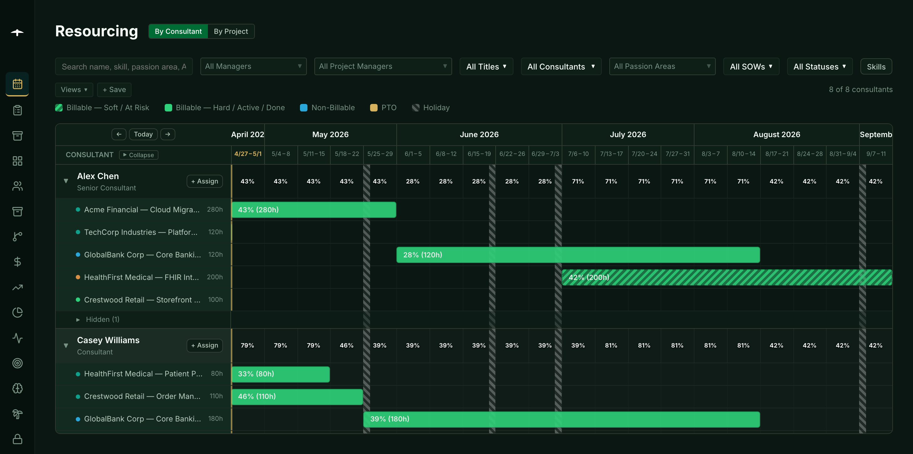
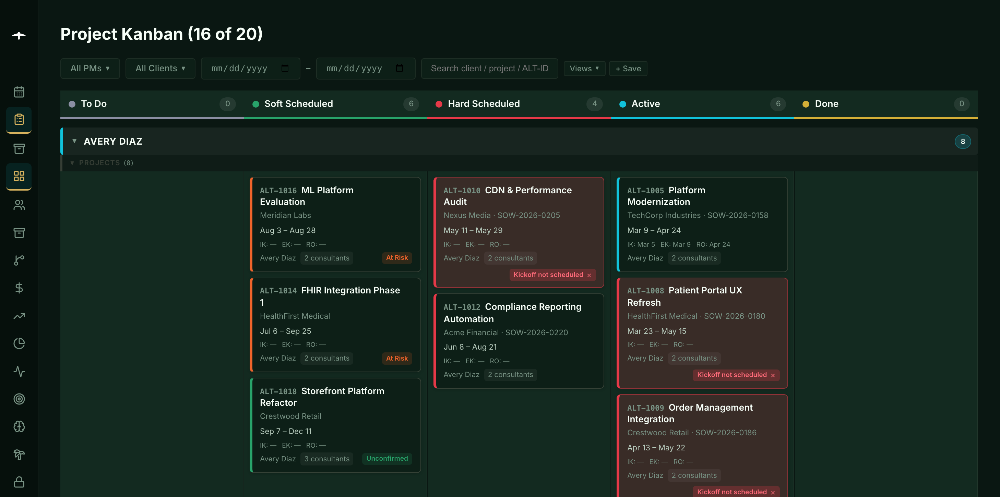
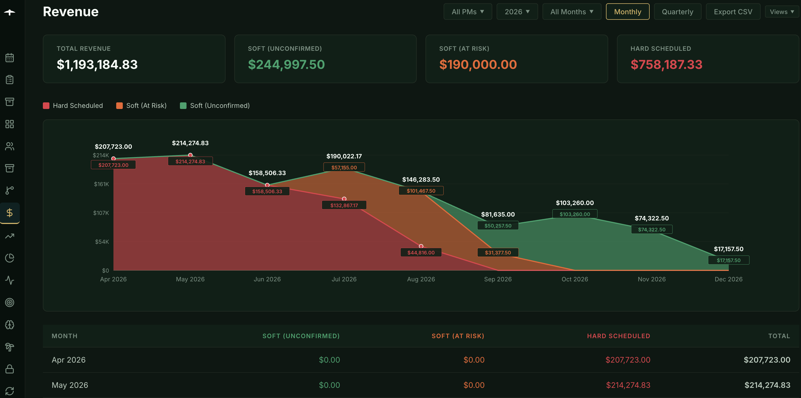
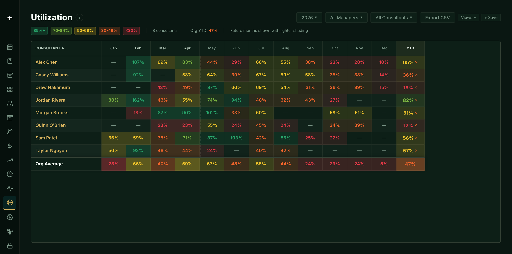
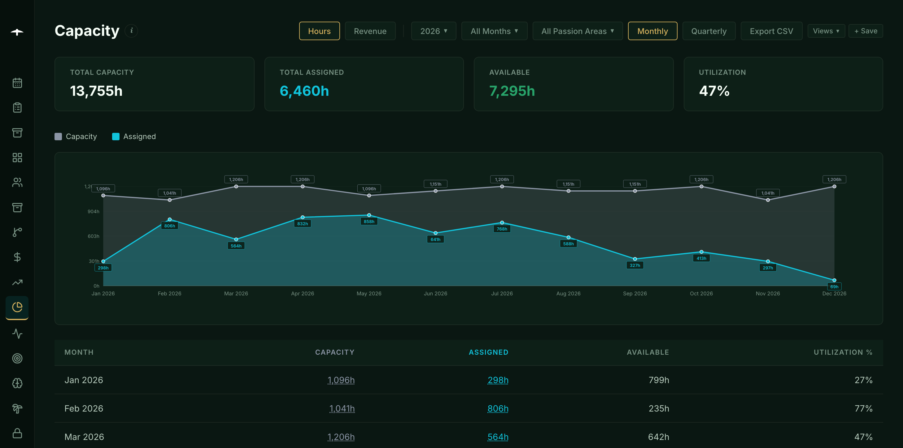
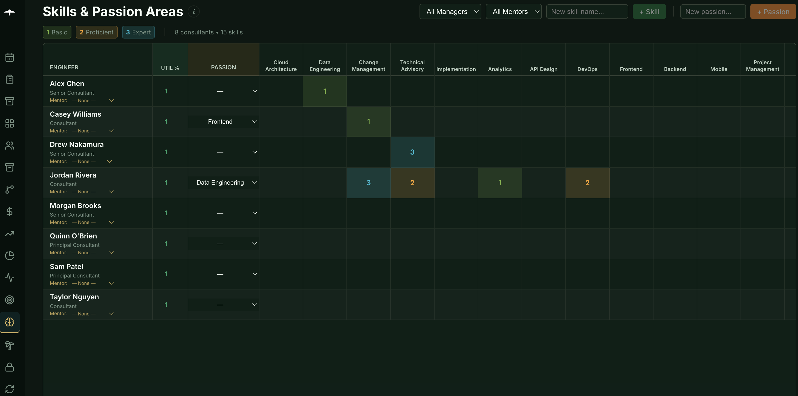
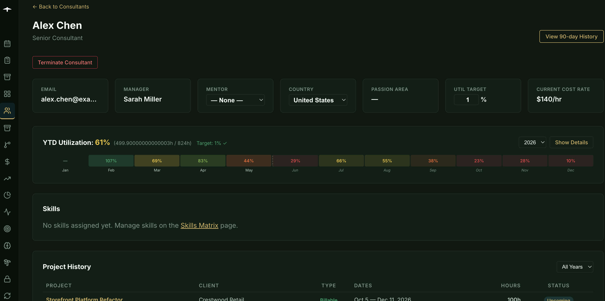
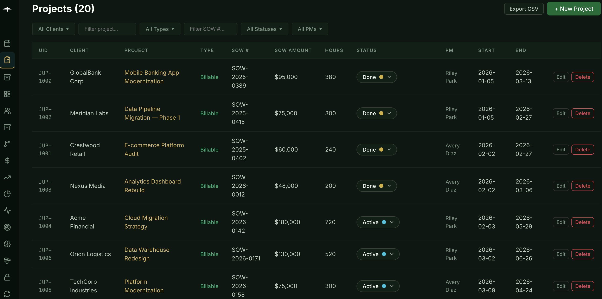
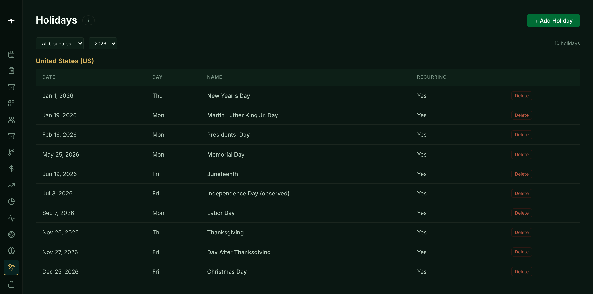
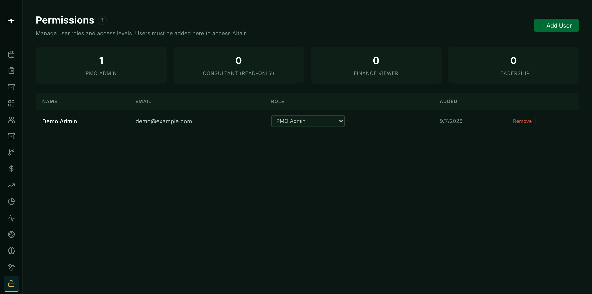

# Altair

A Professional Services Automation (PSA) **exoskeleton** — the data model,
dashboards, auth, and RLS are built in; integrations with your CRM, task
manager, HR system, and chat tool are not. You bring your own, wired through
a small set of adapter interfaces.

Altair ships the hard parts (engineer resourcing, capacity and utilization
math, month-locked revenue snapshots, cost-rate history, permissions) and
leaves what's trivial for you to hook up (where engagements come from, where
PTO comes from, where task checklists live).

## Screenshots

Resourcing — week-by-week consultant allocations on a timeline grid:



Project Kanban — swimlanes by PM, status pills per card:



Revenue — monthly snapshots with hard / soft-at-risk / soft-unconfirmed split:



Utilization — heat-mapped grid of billable utilization by consultant by month:



Capacity — assigned hours vs. capacity per month with PTO and holidays factored in:



Skills Matrix — per-consultant skill levels and passion areas:



Consultant Detail — YTD utilization, project history, cost rate, mentor links:



Projects — flat searchable list with SOW and status:



Holidays — per-country recurring holiday calendar that the capacity math respects:



Permissions — role-based access; users must be added here to log in:



## Try it locally in one command

Requirements: **Docker** and the **Supabase CLI**
([install guide](https://supabase.com/docs/guides/cli)).

```bash
git clone https://github.com/dr-h-cyber/Altair.git
cd Altair
npm install
npm run bootstrap:local
npm run dev        # → open http://localhost:5173
```

The bootstrap script:
1. Runs `supabase start` (local Postgres + Auth + Realtime + Studio in Docker)
2. Applies `supabase/schema.sql` + `supabase/revenue_engine.sql`
3. Seeds a rich demo dataset (16 consultants, 20 projects across 8 clients,
   ~46 assignments over 10 months, locked monthly snapshots, cost rates)
4. Creates a demo admin `demo@example.com` (password `demo-password-1234`)
5. Writes `.env.local` with your local Supabase keys

Log in with the demo account and click around. To reset everything and
re-seed, run `npm run bootstrap:reset`. When you're done, `supabase stop`.

## What's in the box

- **Resourcing** — week-by-week consultant allocations on a timeline grid,
  drag-to-assign, capacity-vs-assigned bars
- **Capacity** — per-consultant monthly capacity with holidays and PTO
  factored in; per-engineer utilization targets
- **Utilization** — billable / non-billable / PTO breakdowns by consultant
- **Revenue** — monthly snapshots with lock-on-month-end semantics
- **Margin** — cost-rate × hours against revenue, per project per month,
  with cost-rate history (old engagements use the rate in effect at the time)
- **Projects & Kanban** — list / detail / swimlane views with saved filters
- **Consultants** — roster, skills matrix, passion areas, cost-rate history
- **Permissions** — role-based access (Casbin) + Supabase RLS + column
  whitelists on the generic data APIs
- **Sync log** — generic audit table for adapter runs

## What's **not** in the box

- A CRM / engagement source — implement `EngagementSource` yourself
  (reference: `POST /api/ingest/engagement` webhook)
- A task manager — use the built-in `tasks` table (reference
  `InternalTasksSink`) or implement your own `TaskSink`
- An HR / PTO feed — implement `TimeOffSource` (reference
  `CsvTimeOffSource`)
- SSO — Supabase Auth ships with email+password; swap for Okta / Google /
  SAML in the Supabase dashboard (paid tier)

See `api/adapters/README.md` for the interface contracts.

## Make it yours

Off-the-shelf PSA and resourcing tools (Mavenlink/Kantata, FinancialForce,
Workamajig, Replicon, Scoro) are expensive, sticky, and rigid. Altair is the
opposite: a small codebase you can read in a weekend, no per-seat license, no
vendor lock-in. Fork it, rename what doesn't fit your team's vocabulary, swap
the pieces that don't match your stack.

**1. Rename the data model.** The schema is one file
(`supabase/schema.sql`) — no migrations to chase. If "consultant" should be
"engineer", "practitioner", or "associate" in your vocabulary; if
`altair_uid` should be `employee_id`; if `practice_manager` should be
`partner` — find-replace in `schema.sql`, re-run `npm run bootstrap:local`,
and the UI follows. The TypeScript types in `src/types/` mirror the DB and
will surface anything you missed at compile time.

**2. Swap the frontend.** The contract between client and database is the
Supabase REST + Realtime API. Anything that can speak HTTP can be a client:
Vue, Svelte, a mobile app, a Slack bot, a CLI, even a desktop tool. The
React app in `src/` is a reference UI — fork it for theming, or replace it
entirely. The serverless handlers in `api/` (RPCs and ingest webhooks) work
the same regardless of what's calling them.

**3. Swap the backend.** Supabase is the default because it's open source
and self-hostable, but it's not load-bearing. To leave Supabase you'd port
the RLS policies in `schema.sql` into your application's auth layer, replace
the RPC functions with HTTP endpoints, and swap Realtime for WebSockets /
polling / your queue of choice. The schema, the adapter contracts, and the
dashboards travel — only the auth/business-logic layer is Supabase-shaped.

### Maintenance philosophy

**Altair is published as a reference, not an actively maintained product.**
We don't triage issues, won't promise reviews, and won't ship roadmap items.
There is no upstream sync — once you fork, your tree is yours.

What we *do* welcome: PRs that fix something demonstrably wrong, security
reports via GitHub Security Advisories, and adapter reference implementations
that fit the existing pattern. Anything else, expect silence — and fork
instead. If a direction we take stops making sense for you, ignore the
merge and keep going.

## Stack

- **Frontend:** React 19 + TypeScript + Vite
- **Backend:** Vercel serverless functions (`api/`)
- **Database:** Supabase (Postgres + Realtime)
- **Auth:** Supabase Auth (email+password by default)
- **Hosting:** Vercel

No other runtime dependencies — no Docker for production, no Redis, no
message queue. All state lives in Postgres. All API calls go through either
Supabase directly (via RLS) or through a Vercel function for privileged ops.

## Wiring an integration

When you're ready to ingest engagements from your CRM, start with the
reference webhook:

```bash
curl -X POST https://<your-deploy>/api/ingest/engagement \
  -H "X-API-Key: $ALTAIR_EXTERNAL_API_KEY" \
  -H "Content-Type: application/json" \
  -d '{
    "external_id": "OPP-12345",
    "client_name": "Acme Corp",
    "project_name": "Annual Platform Review",
    "sow_number": "SOW-2026-0123",
    "sow_amount": 75000,
    "planned_hours": 300,
    "engagement_start": "2026-05-01",
    "engagement_end": "2026-06-15",
    "project_manager_email": "pm@example.com"
  }'
```

To wire a real adapter (e.g. Salesforce, Hubspot, Airtable), copy
`api/ingest/engagement.ts` as a starting point, replace the raw body with a
call to your CRM's API, and schedule it via a GitHub Actions cron.

## Deploying to Vercel

1. Push this repo to your own GitHub org.
2. Create a **production** Supabase project, then apply the schema against
   it with `npm run apply:remote` (reads `.env.local` for the service role
   key + direct connection string) — this runs
   `supabase/schema.sql` + `revenue_engine.sql` + `seed.sql` and creates the
   demo admin. Alternatively paste the three files into the Supabase SQL
   editor in that order.
3. Import the repo at [vercel.com](https://vercel.com). Framework preset:
   Vite.
4. Add env vars to Vercel (Settings → Environment Variables):
   - `VITE_SUPABASE_URL`
   - `VITE_SUPABASE_ANON_KEY`
   - `SUPABASE_URL`
   - `SUPABASE_SERVICE_ROLE_KEY`
   - `ALLOWED_ORIGINS=https://altair.example.com`
   - `ALTAIR_BASE_URL=https://altair.example.com`
   - `ALTAIR_EXTERNAL_API_KEY` (generate a long random string)
5. Deploy.

## Publishing a public demo

If you want a browsable demo anyone can click through (e.g.
`demo.altair.example.com`):

1. Create a **separate** Supabase project for the demo (stays on the free
   tier — the seed is tiny).
2. Deploy a separate Vercel project targeting that Supabase URL.
3. (Recommended) Enable the nightly reset workflow at
   `.github/workflows/demo-reset.yml.example` — rename to `.yml`, set
   `DEMO_SUPABASE_DB_URL` as a repo secret, and it'll wipe + re-seed your
   demo every 24h so visitors can poke around without permanent damage.
4. (Optional) Create a read-only `demo_readonly` user and expose that
   instead of `demo@example.com` to prevent writes entirely.

## Project layout

```
api/               Vercel serverless handlers
  _lib/            Auth, Casbin, Supabase admin client, email, slack
  adapters/        Interface definitions (EngagementSource, TaskSink, etc.)
                   and reference implementations
  data/            Read-through data API (RLS-gated)
  external/        API-key-authed read/patch API
  ingest/          Reference webhook handlers for adapters
  rpc/             Write RPCs (create-project, update-assignment, etc.)
public/            Static assets
scripts/
  bootstrap-local.sh   One-command local demo
src/
  components/      Shared UI
  hooks/           Data-fetching hooks (one per dashboard)
  lib/             API client, Supabase client, auth context, utilities
  pages/           One per route
  types/           TS types mirroring DB schema
supabase/
  schema.sql       Consolidated schema — tables, enums, RPCs, RLS, grants,
                   realtime publication (apply against a fresh empty schema)
  revenue_engine.sql  Monthly snapshot generation (apply after schema.sql)
  seed.sql         Rich demo dataset (apply last)
templates/         Example project-task templates (JSON)
middleware.ts      Vercel edge middleware (CORS + JWT presence)
vercel.json        Routing, CSP, headers
```

## Status

Early OSS release. The DB shape lives in a single `supabase/schema.sql` —
you can `psql -f supabase/schema.sql` against an empty Postgres and the app
works. The revenue engine and seed data are separate files applied after.

**Forks encouraged. Issues will likely sit unread.** See "Maintenance
philosophy" above.

## License

MIT — see `LICENSE`.
